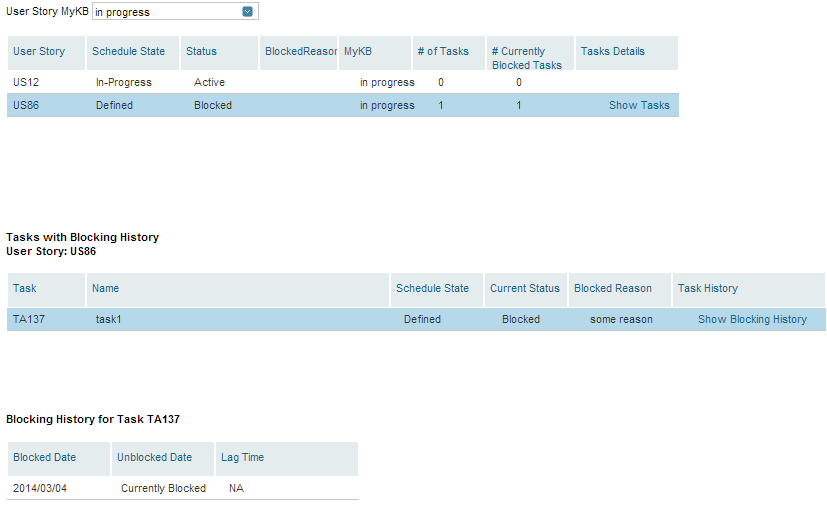

Blocking History of stories with Kanban State
=========================

## Overview
This is a modified version of Blocking History app. The original app is available from Rally App Catalog
https://help.rallydev.com/blocking-history
In the modified app iteration dropdown was replaced
with attribute dropdown based on a custom Kanban field.
This version of the app is not included in the Rally App Catalog, and is not supported.

1 . Replace  all occurrances of'MyKB' with a name of Kanban Custom Field valid in your workspace.
As long as a valid FieldName of this field is used, the attribute dropdown will be populated with allowed values automatically
2. Use valid OIDs of your workspace and project when intstantiating rally.sdk.data.RallyDataSource if running the app outside of Rally

## License

AppTemplate is released under the MIT license.  See the file [LICENSE](https://raw.github.com/RallyApps/AppTemplate/master/LICENSE) for the full text.
